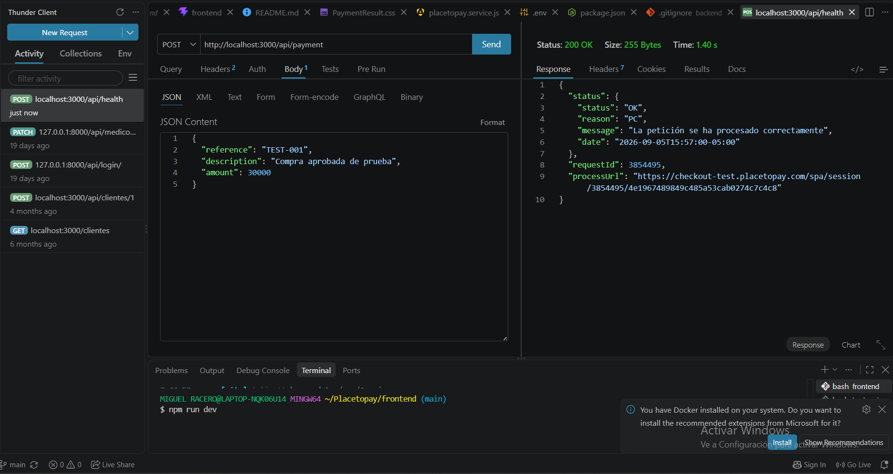
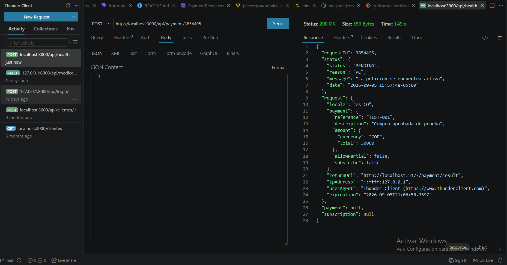

# Endpoints utilizados

- [Regresar](./../README.md)

Para realizar el flujo de pago se implementaron dos endpoints en el backend: uno para crear una sesión de 
pago y otro para consultar su estado.

## Crear sesión de pago

```http
POST /api/payment
```

El frontend envía la información de la compra:

```json
{
  "reference": "TEST-001",
  "description": "Compra tienda de prueba",
  "amount": 12000
}
```

El backend utiliza esta información para crear una sesión en Placetopay y obtiene como respuesta el 
`requestId` y el `processUrl`.

```json
{
  "requestId": 3854358,
  "processUrl": "https://checkout-test.placetopay.com/..."
}
```

El `processUrl` se utiliza para redirigir al usuario al WebCheckout de Placetopay.

### Evidencia



---

## Consultar sesión

```http
POST /api/payment/:requestId
```

Este endpoint permite consultar una sesión utilizando el `requestId` obtenido al momento de crearla.

Ejemplo:

```http
POST /api/payment/3854358
```

Placetopay devuelve el estado de la sesión y la información de los intentos de pago realizados.

Los principales estados utilizados en la prueba son:

- `APPROVED`: pago aprobado.
- `PENDING`: pago pendiente.
- `REJECTED`: pago rechazado.

### Evidencia

