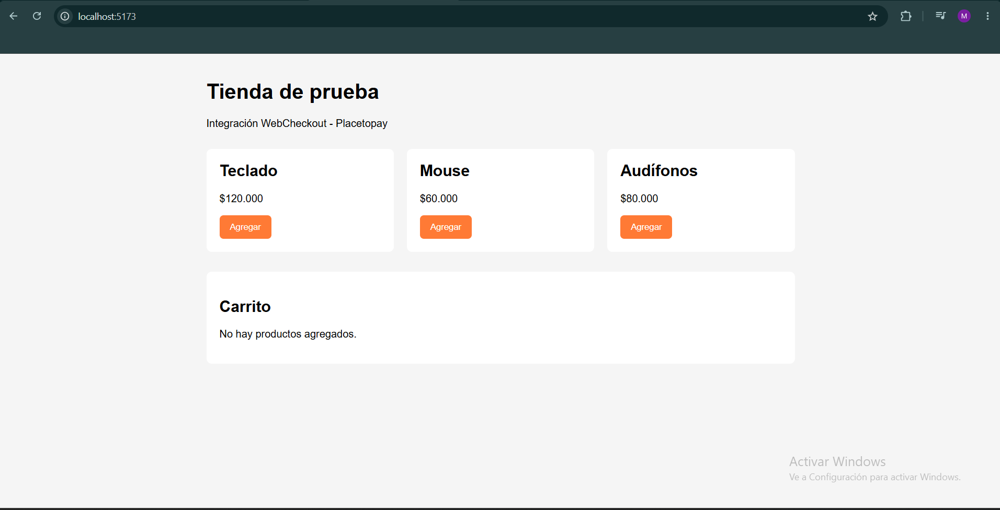
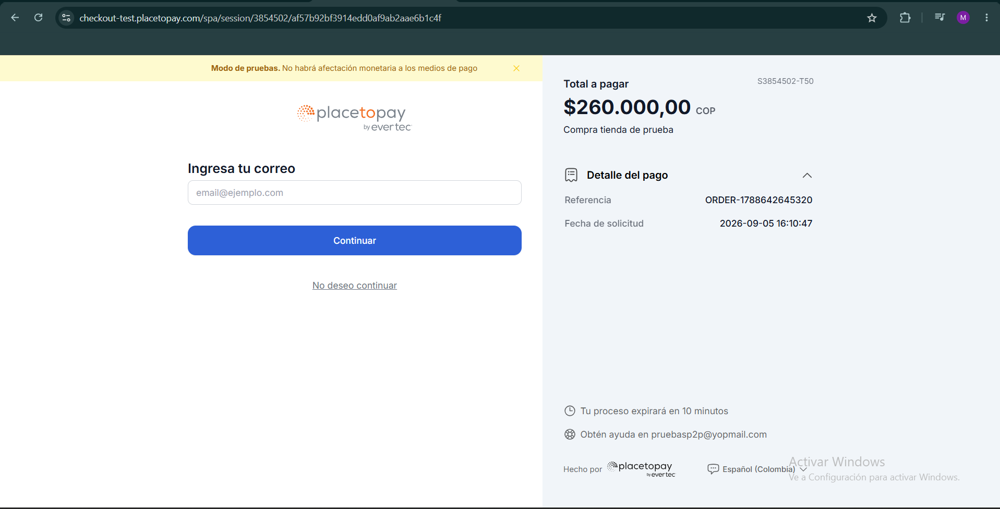
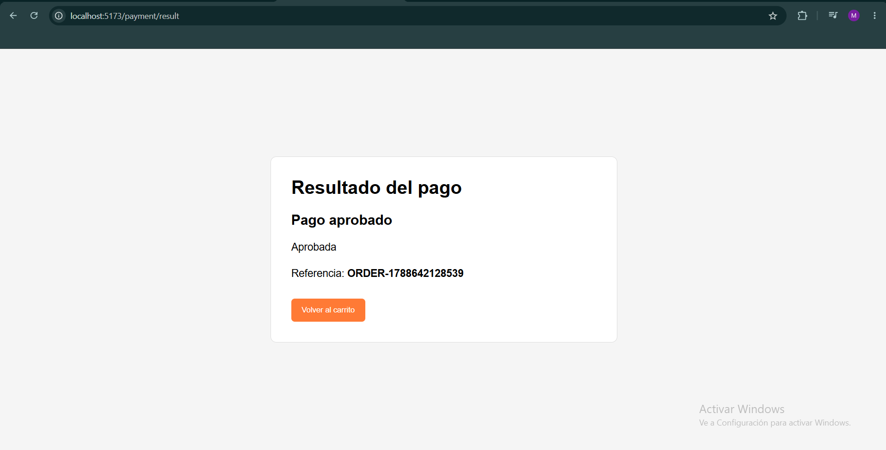
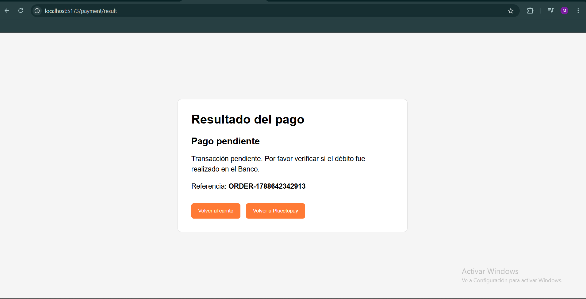

# Evidencias del flujo transaccional

- [Regresar](./../README.md)

A continuación se presentan las evidencias obtenidas durante las pruebas realizadas en el ambiente de 
pruebas de Placetopay WebCheckout.

## Tienda de prueba

La aplicación permite agregar productos a un carrito y posteriormente iniciar el proceso de pago con 
Placetopay.

## Checkout de Placetopay

Después de crear la sesión, el usuario es redirigido al WebCheckout de Placetopay para seleccionar y 
utilizar el medio de pago.

## Transacción aprobada

Se realizó una prueba obteniendo como resultado una transacción aprobada.

## Transacción pendiente

Se realizó una prueba simulando una transacción pendiente.
En caso tal de estar en pendiente, tiene la opcion de regresar a su misma sesion por el ("requestId") 

## Transacción rechazada

Se realizó una prueba obteniendo como resultado una transacción rechazada.

