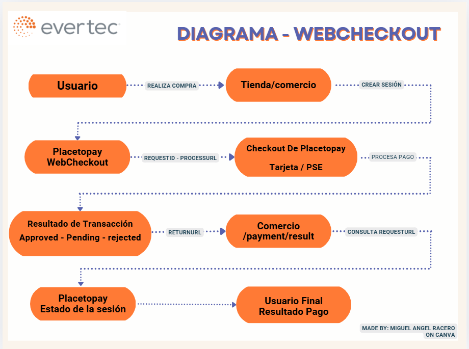
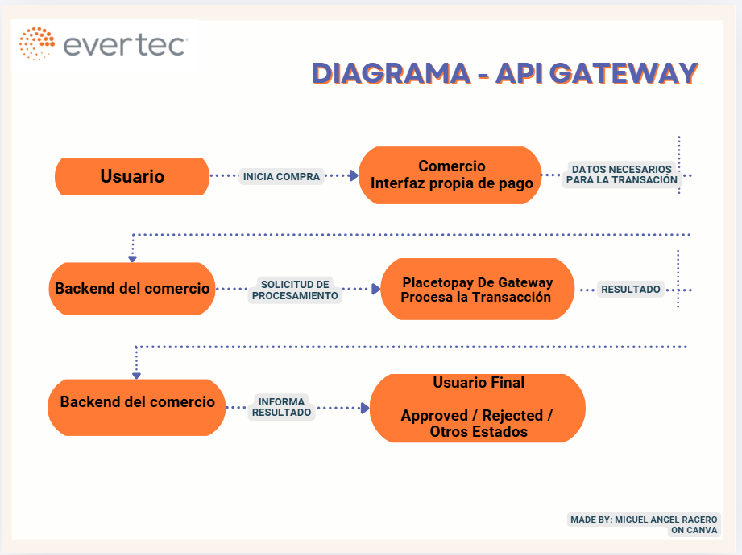

# DIAGRAMAS - WEBCHECKOUT Y API GATEWAY

- [Regresar](./README.md)

A continuación se presenta el flujo de pago (Usuario Final - Comercio - Placetopay), entendiendo la
documentación del punto inicial, se presenta el flujo de WebCheckout y de Api Gateway.

**Ambos diagramas fueron realizados en Canvas**

## Flujo del pago con WebCheckout

El proceso comienza cuando el usuario selecciona los productos que desea comprar y solicita realizar el pago.
El comercio envía la informacion necesaria a Placetopay para crear la sesión de WebCheckout; como respuesta
Placetopay responde con `requestId` que identifica la sesión, y un `processUrl` que redirige a el usuario al
checkout.
El usuario continúa con el proceso de pago en la interfaz de Placetopay, donde selecciona el metodo de pago
e ingresa los datos requeridos. Al finalizar el proceso Placetopay redirige al usario hacia `returnUrl` 
definifa por el comercio.
Finalmente, el comercio utiliza el `requestId` para consultar el estado de la sesión y mostrar al usuario el 
resultado correspondiente.

### Diagrama WebCheckout

## Flujo de pago con API Gateway

En API Gateway el comercio tiene mayor control sobre la experiencia y el proceso de integración.

El usuario inicia el pago desde la interfaz proporcionada por el comercio. El sistema recopila la 
información necesaria para realizar la operación y el backend envía la solicitud de procesamiento a 
Placetopay mediante API Gateway. Placetopay procesa la transacción y devuelve el resultado al sistema del 
comercio, que posteriormente informa al usuario sobre el estado de la operación.
A diferencia de WebCheckout, el comercio tiene mayor responsabilidad sobre la interfaz y los datos
necesarios para realizar el proceso transaccional.

### Diagrama Api Gateway

